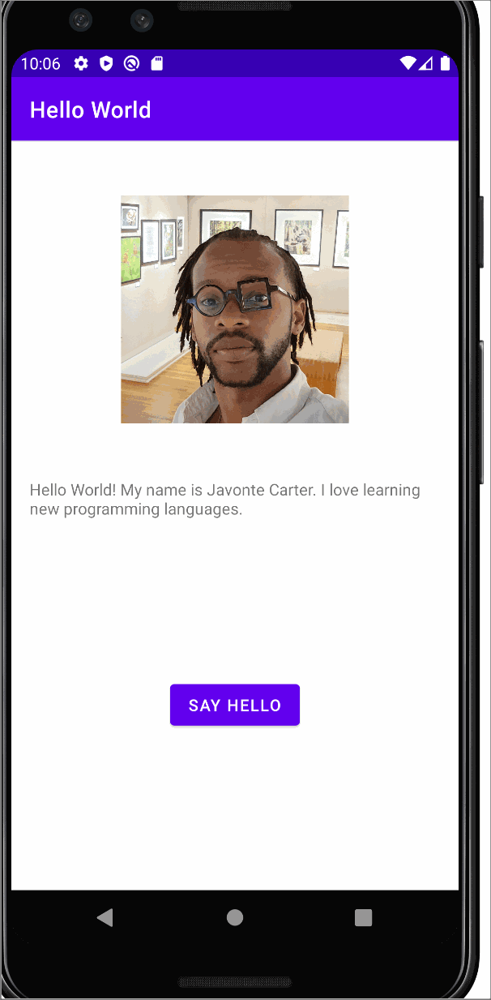

# Android Prework - *Hello World*

Submitted by: **Javonte Carter**

**Hello World** is an android app that shows an image and introductory message, and allows pressing a button to display a Toast. 

Time spent: **10** hours spent in total

## Required Features

The following **required** functionality is completed:

* [x] Image and introductory message displayed on screen
* [x] Button displayed on screen
* [x] Toast with message appears when button is pressed 

The following **optional** features are implemented:

* [ ] List anything else that you can get done to improve the app functionality!

## Video Walkthrough

Here's a walkthrough of implemented features:

<!-- Replace this with whatever GIF tool you used! -->
GIF created with [LiceCap](http://www.cockos.com/licecap/).  
<!-- Other options include:
[Kap](https://getkap.co/) for macOS
[ScreenToGif](https://www.screentogif.com/) for Windows
[peek](https://github.com/phw/peek) for Linux. -->

## Notes

One challenge I stumbled on was trying to get my project to commit to GitHub from Android Studio. I kept receiving this error message:
Can't finish GitHub sharing process
				Successfully created project 'Hello_World1' on GitHub, but initial push failed:
				Invocation failed Unexpected end of file from server
				java.lang.RuntimeException: Invocation failed Unexpected end of file from server
				at git4idea.GitAppUtil.sendXmlRequest(GitAppUtil.java:30)
				at git4idea.http.GitAskPassApp.main(GitAskPassApp.java:58)
				Caused by: java.net.SocketException: Unexpected end of file from server
				at java.base/sun.net.www.http.HttpClient.parseHTTPHeader(HttpClient.java:866)
				at java.base/sun.net.www.http.HttpClient.parseHTTP(HttpClient.java:689)
				at java.base/sun.net.www.http.HttpClient.parseHTTPHeader(HttpClient.java:863)
				at java.base/sun.net.www.http.HttpClient.parseHTTP(HttpClient.java:689)
				at java.base/sun.net.www.protocol.http.HttpURLConnection.getInputStream0(HttpURLConnection.java:1615)
				at java.base/sun.net.www.protocol.http.HttpURLConnection.getInputStream(HttpURLConnection.jav... (show balloon)
I was able to over come this block in the road by using this website: https://stackoverflow.com/questions/66508158/git-pull-failed-invocation-failed-unexpected-end-of-file-from-server/70375874#70375874.
Although I was able to complete the project, I found that Android Studio would take long to run the emulator.

## License

    Copyright [2022] [Javonte Carter]

    Licensed under the Apache License, Version 2.0 (the "License");
    you may not use this file except in compliance with the License.
    You may obtain a copy of the License at

        http://www.apache.org/licenses/LICENSE-2.0

    Unless required by applicable law or agreed to in writing, software
    distributed under the License is distributed on an "AS IS" BASIS,
    WITHOUT WARRANTIES OR CONDITIONS OF ANY KIND, either express or implied.
    See the License for the specific language governing permissions and
    limitations under the License.
